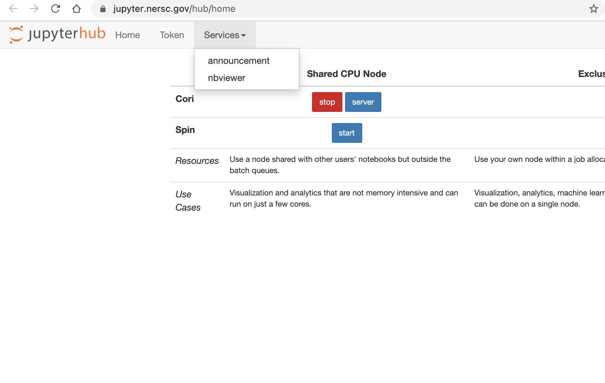
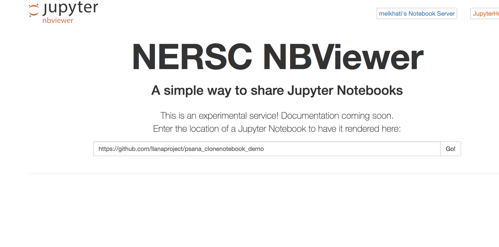
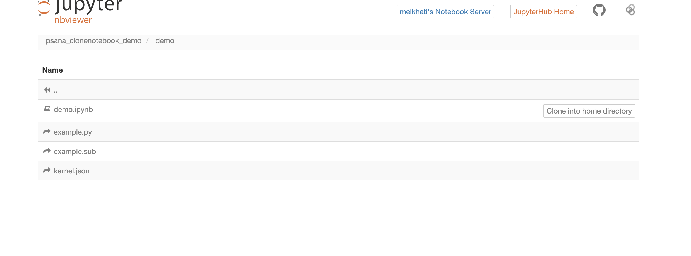
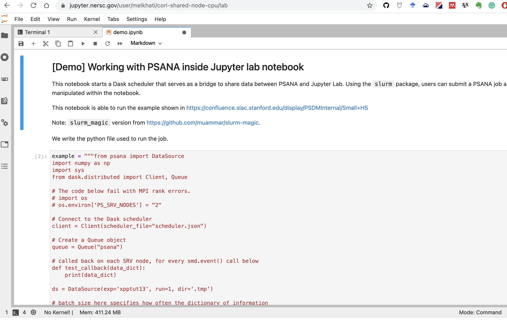

# PSANA clonenotebook demo

This notebook is a demo of PSANA imported with `clonenotebook` service
available at NERSC. [clonenotebook](https://github.com/NERSC/clonenotebooks)
is an advantageous and simple way to share a Jupyter notebook, and make it
functional for others to try on their own JupyterHub account.

## Instructions

To use it, do the following:

1. Go to https://jupyter.nersc.gov/hub/home and click on the `Services > nbviewer` menu.

2. Paste `https://github.com/llanaproject/psana_clonenotebook_demo` on the URL box, and click Go!.

3. Browse through the directory `demo`, and click on `Clone into the home
directory`. This step will clone this notebook from Github, and install the
PSANA conda kernel.

4. Change the Conda kernel to `psana2_py37_gh`.  Execute the cells!

